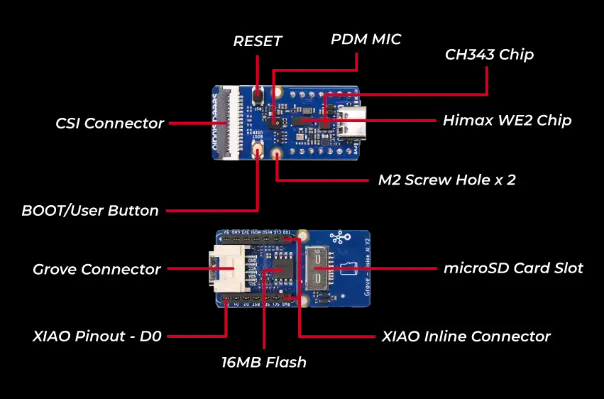

## How to build yolov8n pose scenario_app and run on WE2?
### Linux Environment
- Change the `APP_TYPE` to `tflm_yolov8_pose` at [makefile](https://github.com/HimaxWiseEyePlus/Seeed_Grove_Vision_AI_Module_V2/blob/main/EPII_CM55M_APP_S/makefile)
    ```
    APP_TYPE = tflm_yolov8_pose
    ```
- Build the firmware reference the part of [Build the firmware at Linux environment](https://github.com/HimaxWiseEyePlus/Seeed_Grove_Vision_AI_Module_V2?tab=readme-ov-file#build-the-firmware-at-linux-environment)
- How to flash firmware image and model at [model_zoo](https://github.com/HimaxWiseEyePlus/Seeed_Grove_Vision_AI_Module_V2/tree/main/model_zoo)?
  - Prerequisites for xmodem
    - Please install the package at [xmodem/requirements.txt](https://github.com/HimaxWiseEyePlus/Seeed_Grove_Vision_AI_Module_V2/tree/main/xmodem/requirements.txt) 
        ```
        pip install -r xmodem/requirements.txt
        ```
  - Disconnect `Minicom`
  - Make sure your `Seeed Grove Vision AI Module V2` is connect to PC.
  - Open the permissions to acceess the deivce
    ```
    sudo setfacl -m u:[USERNAME]:rw /dev/ttyUSB0
    # in my case
    # sudo setfacl -m u:kris:rw /dev/ttyACM0
    ```
    
  - Open `Terminal` and key-in following command
    - port: the COM number of your `Seeed Grove Vision AI Module V2`, for example,`/dev/ttyACM0`
    - baudrate: 921600
    - file: your firmware image [maximum size is 1MB]
    - model: you can burn multiple models "[model tflite] [position of model on flash] [offset]"
      - Position of model on flash is defined at [~/tflm_yolov8_pose/common_config.h](https://github.com/HimaxWiseEyePlus/Seeed_Grove_Vision_AI_Module_V2/blob/main/EPII_CM55M_APP_S/app/scenario_app/tflm_yolov8_pose/common_config.h#L21)
        ```
        python3 xmodem/xmodem_send.py --port=[your COM number] --baudrate=921600 --protocol=xmodem --file=we2_image_gen_local/output_case1_sec_wlcsp/output.img --model="model_zoo/tflm_yolov8_pose/yolov8n_pose_256_vela_3_9_0x3BB000.tflite 0x3BB000 0x00000"

        # example:
        # python3 xmodem/xmodem_send.py --port=/dev/ttyACM0 --baudrate=921600 --protocol=xmodem --file=we2_image_gen_local/output_case1_sec_wlcsp/output.img --model="model_zoo/tflm_yolov8_pose/yolov8n_pose_256_vela_3_9_0x3BB000.tflite 0x3BB000 0x00000"
        ```
    - It will start to burn firmware image and model automatically.
  -  Please press `reset` buttun on `Seeed Grove Vision AI Module V2`.
     
  - It will success to run the algorithm.

[Back to Outline](https://github.com/HimaxWiseEyePlus/Seeed_Grove_Vision_AI_Module_V2?tab=readme-ov-file#outline)

### Windows Environment
- Change the `APP_TYPE` to `tflm_yolov8_pose` at [makefile](https://github.com/HimaxWiseEyePlus/Seeed_Grove_Vision_AI_Module_V2/blob/main/EPII_CM55M_APP_S/makefile)
    ```
    APP_TYPE = tflm_yolov8_pose
    ```
- Build the firmware reference the part of [Build the firmware at Windows environment](https://github.com/HimaxWiseEyePlus/Seeed_Grove_Vision_AI_Module_V2?tab=readme-ov-file#build-the-firmware-at-windows-environment)
- How to flash firmware image and model at [model_zoo](https://github.com/HimaxWiseEyePlus/Seeed_Grove_Vision_AI_Module_V2/tree/main/model_zoo)?
  - Prerequisites for xmodem
    - Please install the package at [xmodem/requirements.txt](https://github.com/HimaxWiseEyePlus/Seeed_Grove_Vision_AI_Module_V2/tree/main/xmodem/requirements.txt) 
        ```
        pip install -r xmodem/requirements.txt
        ```
  - Disconnect `Tera Term`
  - Make sure your `Seeed Grove Vision AI Module V2` is connect to PC.
  - Open `CMD` and key-in following command
    - port: the COM number of your `Seeed Grove Vision AI Module V2` 
    - baudrate: 921600
    - file: your firmware image [maximum size is 1MB]
    - model: you can burn multiple models "[model tflite] [position of model on flash] [offset]"
      - Position of model on flash is defined at [~/tflm_yolov8_pose/common_config.h](https://github.com/HimaxWiseEyePlus/Seeed_Grove_Vision_AI_Module_V2/blob/main/EPII_CM55M_APP_S/app/scenario_app/tflm_yolov8_pose/common_config.h#L21)
        ```
        python xmodem\xmodem_send.py --port=[your COM number] --baudrate=921600 --protocol=xmodem --file=we2_image_gen_local\output_case1_sec_wlcsp\output.img --model="model_zoo\tflm_yolov8_pose\yolov8n_pose_256_vela_3_9_0x3BB000.tflite 0x3BB000 0x00000"

        # example:
        # python xmodem\xmodem_send.py --port=COM123 --baudrate=921600 --protocol=xmodem --file=we2_image_gen_local\output_case1_sec_wlcsp\output.img --model="model_zoo\tflm_yolov8_pose\yolov8n_pose_256_vela_3_9_0x3BB000.tflite 0x3BB000 0x00000"
        ```
    - It will start to burn firmware image and model automatically.
  -  Please press `reset` buttun on `Seeed Grove Vision AI Module V2`.
      
  - It will success to run the algorithm.


[Back to Outline](https://github.com/HimaxWiseEyePlus/Seeed_Grove_Vision_AI_Module_V2?tab=readme-ov-file#outline)

### Send image and meta data by UART
- Disconnect the uart at your `Tera Term` or `Minicom` first.
- You can use the [Himax AI web toolkit](https://github.com/HimaxWiseEyePlus/Seeed_Grove_Vision_AI_Module_V2/releases/download/v1.1/Himax_AI_web_toolkit.zip) which we provide, download it and unzip it to local PC, and double click `index.html`.
- Please check you select `Grove Vision AI(V2)` and press `connect` button
    
- Select your own COM.
    
- You will see the preview result on website.
- Tip
    - Windows:
        - Please use "Microsoft Edge" browser
    - Linux:
        - Open the permissions to acceess the deivce
            ```
            sudo setfacl -m u:[USERNAME]:rw /dev/ttyUSB0
            # in my case
            # sudo setfacl -m u:kris:rw /dev/ttyACM0
            ```
        - Please use "Google Chrome" browser

[Back to Outline](https://github.com/HimaxWiseEyePlus/Seeed_Grove_Vision_AI_Module_V2?tab=readme-ov-file#outline)

### Model source link
- [Yolov8n pose](https://github.com/HimaxWiseEyePlus/YOLOv8_on_WE2?tab=readme-ov-file#yolov8n-pose)

[Back to Outline](https://github.com/HimaxWiseEyePlus/Seeed_Grove_Vision_AI_Module_V2?tab=readme-ov-file#outline)

---

## Output Mode Configuration (I2C / UART)

### Overview
This firmware supports three output modes for sending JSON results:

| Mode | Value | Description |
|------|-------|-------------|
| UART only | 0 | Output via USB Type-C (default, 921600 baud) |
| I2C only | 1 | Output via Grove connector (I2C Slave, address 0x62) |
| Both | 2 | Output to both USB and Grove (may impact performance) |

### How to Configure

Edit `tflm_yolov8_pose_reid.mk` and change `OUTPUT_MODE`:

```makefile
# Output Mode Selection
# Options:
#   0 = UART only (USB Type-C, default)
#   1 = I2C only (Grove connector, for ESP32/XIAO connection)
#   2 = Both UART and I2C (may have performance impact)
##
OUTPUT_MODE := 1   # Change this value
```

### I2C Connection (OUTPUT_MODE = 1 or 2)

When I2C output is enabled:
- **I2C Address**: `0x62`
- **Grove Connector Pins**: PA2 (SCL), PA3 (SDA)
- **Protocol**: I2C Slave mode - master (ESP32/XIAO) reads data from Vision AI

#### Wiring for ESP32/XIAO:
| Grove Vision AI V2 | ESP32/XIAO |
|-------------------|------------|
| GND (Black) | GND |
| VCC (Red) | 3.3V |
| SDA (White) | SDA (I2C) |
| SCL (Yellow) | SCL (I2C) |

### ESP32 Example Code (I2C Master)
```cpp
#include <Wire.h>

#define VISION_AI_ADDR 0x62
#define BUFFER_SIZE 4096

char buffer[BUFFER_SIZE];

void setup() {
  Serial.begin(115200);
  Wire.begin();  // Initialize I2C as master
  Wire.setClock(400000);  // 400kHz
}

void loop() {
  int idx = 0;
  
  // Request data from Vision AI
  Wire.requestFrom(VISION_AI_ADDR, 32);  // Read 32 bytes at a time
  
  while (Wire.available() && idx < BUFFER_SIZE - 1) {
    buffer[idx++] = Wire.read();
  }
  buffer[idx] = '\0';
  
  if (idx > 0) {
    Serial.print(buffer);
  }
  
  delay(10);  // Small delay between reads
}
```

### Notes
- I2C mode uses interrupt-based transmission for efficiency
- For high frame rates with large JPEG images, UART (USB) is recommended
- The I2C slave prepares data when the master initiates a read request